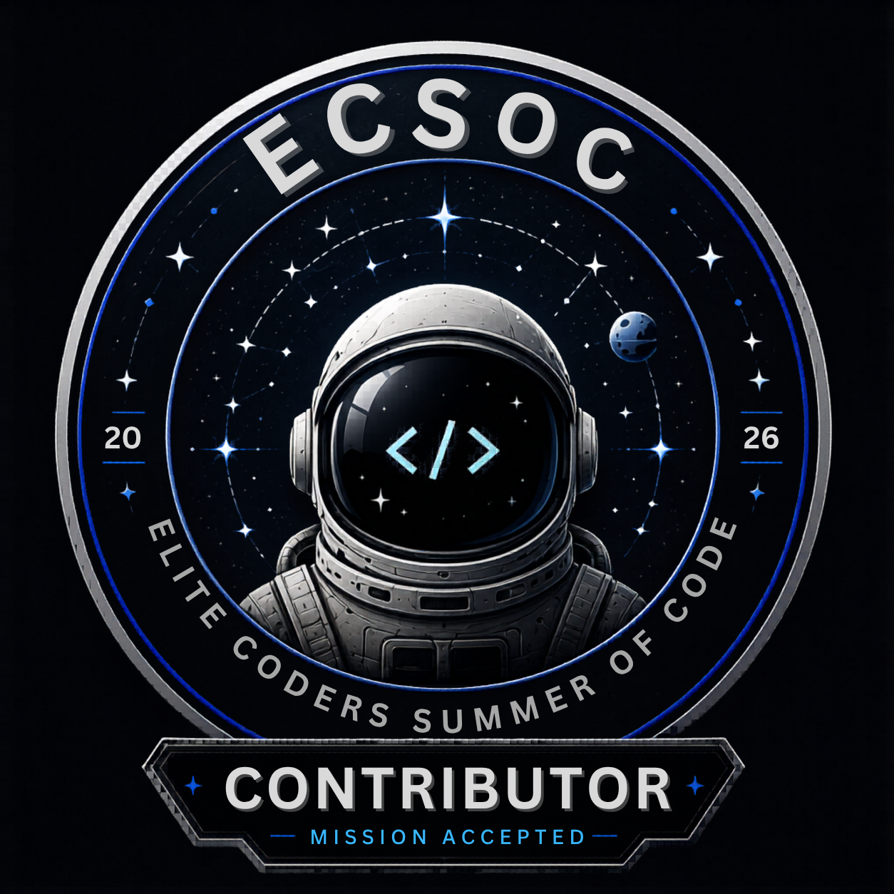
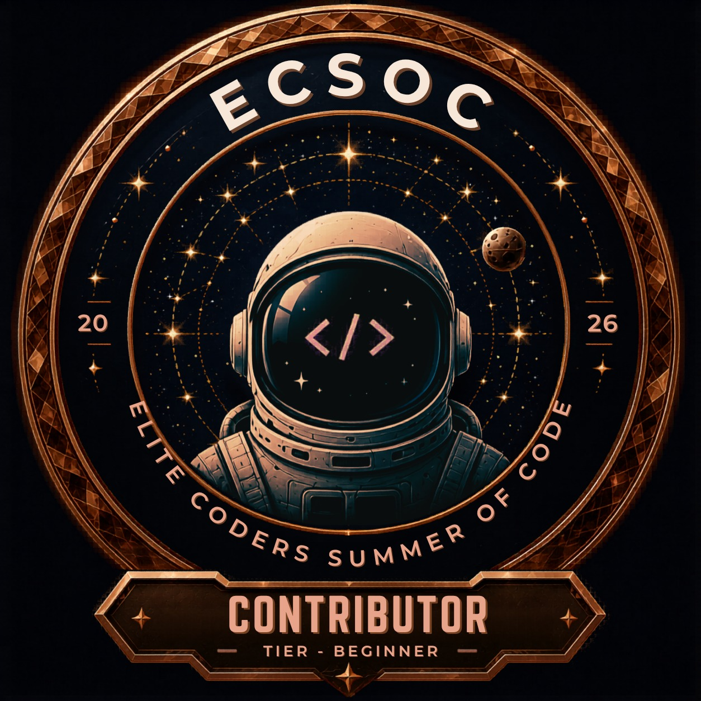

<!-- <div align="center">


<a href="https://readme-typing-svg.demolab.com">
  
</a>

<br/>

<a href="https://dhruvi-dev.vercel.app">
  
</a>
<a href="https://www.linkedin.com/in/technical-dhruvi">
  
</a>
<a href="mailto:technicaldhruvi06@gmail.com">
  
</a>

<br/><br/>


</div>

<br/>

## About Me

```typescript
const dhruvi = {
  role: "Full Stack Developer",
  focus: "Scalable web apps with clean architecture",
  learning: ["React Native", "System Design", "AI Engineering"],
  tools: ["React", "Node.js", "MongoDB", "AI-assisted IDEs"],
  status: "Building, shipping, and leveling up daily"
};
```

I'm Dhruvi, a full stack developer who enjoys turning ideas into production-ready web applications. I work across the stack, from designing clean, responsive frontends to building reliable backend systems and APIs, with a strong focus on maintainable architecture over quick hacks.

My workflow blends solid engineering fundamentals with modern AI-assisted development tools, which helps me move faster while still owning every design and architectural decision. I care about writing code that is readable, testable, and built to scale, and I treat every project as a chance to sharpen my problem-solving skills.

Long term, I'm working toward becoming a well-rounded developer who is equally comfortable across web and mobile, with a deep enough understanding of systems and AI to build genuinely useful products, not just features.

<br/>

## Currently Learning

```
🌱 Mobile App Development
🌱 React Native
🌱 Android Development
🌱 Data Structures & Algorithms
🌱 System Design
🌱 Cloud Technologies
🌱 AI Engineering
```

<div align="center">

| Stage | Focus Area | Status |
|---|---|---|
| 01 | Data Structures & Algorithms | In Progress |
| 02 | System Design Fundamentals | In Progress |
| 03 | React Native & Android | In Progress |
| 04 | Cloud Technologies | Exploring |
| 05 | AI Engineering | Exploring |

</div>

<br/>

## Tech Stack

**Programming Languages**


**Frontend Development**


**Backend Development**


**Database**


**Mobile Development**


**Cloud & Deployment**


**Developer Tools**


**Design Tools**


<br/>

## AI Developer Toolkit

I actively use AI tools to speed up my development workflow while keeping full control over architecture, logic, and code quality.

| Tool | How I Use It |
|---|---|
| GitHub Copilot | Using for in-editor code suggestions and boilerplate |
| Claude Code | Using for planning, debugging, and refactoring |
| ChatGPT | Using for research, documentation, and problem breakdown |
| Cursor | Using as an AI-native code editor |
| Google AI Studio | Exploring for prototyping AI features |
| Gemini | Exploring for research and content assistance |
| Gemini CLI | Learning for terminal-based AI workflows |

These tools support my process, they don't replace understanding the fundamentals. I use them to move faster, catch mistakes early, and explore ideas, while every architectural and design decision stays mine.

<br/>

<br/>

## 🚀 ECSoC'26 Open Source Journey

<div align="center">

### Elite Coders Summer of Code 2026

| 🎯 Metric | 📊 Value |
|:---------:|:--------:|
| 💻 Role | **Contributor** |
| ⭐ Current Score | **1340** |
| 🏅 Current Global Rank | **#46** |
| 🚀 Program | **ECSoC'26** |

</div>

<br/>

### 🏅 Badges Earned

<div align="center">






</div>

<br/>

### 💻 Contribution Highlights

- 🚀 Active contributor in **Elite Coders Summer of Code 2026 (ECSoC'26)**
- 🌟 Contributing to real world open source repositories
- 🛠️ Working on feature development, bug fixes, documentation, and code reviews
- 🤝 Collaborating with developers using Git and GitHub
- 📈 Current Score: **1340**
- 🏅 Current Rank: **#46**
- 🎖️ Earned **Mission Accepted**, **Rookie**, **Beginner**, and **Hustler** contributor badges

## Featured Projects

<table>
<tr>
<td width="50%">

### HR Management System

A complete HR management platform for handling employee data, attendance, and payroll workflows.

**Tech Stack:** React · Node.js · Express · MongoDB

**Features**
- Employee management
- Attendance tracking
- Payroll processing
- Authentication and role-based access
- Admin dashboard

`[Screenshot Placeholder]`


</td>
<td width="50%">

### Invoice Generator (Paymint)

A billing and invoicing tool that streamlines invoice creation and payment tracking.

**Tech Stack:** React · Node.js · MongoDB

**Features**
- Invoice creation
- Billing workflow management
- PDF generation
- Client and payment tracking

`[Screenshot Placeholder]`


</td>
</tr>
<tr>
<td width="50%">

### Micro Event Discovery

A platform for discovering local events with real-time updates and notifications.

**Tech Stack:** React · Node.js · MongoDB

**Features**
- Event discovery and search
- Real-time updates
- Notifications
- Location-based browsing

`[Screenshot Placeholder]`


</td>
<td width="50%">

</td>
</tr>
</table>

<br/>

## Services I Offer

```
🚀 Full Stack Development
🚀 Business Websites
🚀 SaaS Applications
🚀 REST API Development
🚀 Dashboard Development
🚀 UI Development
🚀 AI Integration
🚀 Deployment & Hosting Setup
```

<br/>

## GitHub Analytics

<div align="center">


</div>

<br/>

## GitHub Metrics

<div align="center">


</div>

<br/>

## Achievements

```text
🏆 ECSoC'26 Open Source Contributor
🏆 Current ECSoC Score: 1340
🏆 Current ECSoC Rank: #46
🏆 Earned Mission Accepted, Rookie, Beginner & Hustler badges
🏆 Built and deployed production-ready web applications
🏆 Continuous learner in Web, Mobile & AI Engineering
```

<br/>

## 2026 Goals

- [ ] Strengthen Data Structures & Algorithms fundamentals
- [ ] Build and ship mobile applications with React Native
- [ ] Build AI-powered products end to end
- [ ] Contribute to open source projects consistently
- [ ] Deepen system design knowledge for large-scale applications

<br/>

<div align="center">

### "Good code is written for the next developer to understand, not just for the machine to run."

</div>

<br/>

<div align="center">

## Let's Build Something Great Together

<a href="https://dhruvi-dev.vercel.app">
  
</a>
<a href="https://www.linkedin.com/in/technical-dhruvi">
  
</a>
<a href="mailto:technicaldhruvi06@gmail.com">
  
</a>

<br/><br/>


</div> -->


<div align="center">



<br/>


<br/><br/>

<a href="https://dhruvi-dev.vercel.app"></a>
<a href="https://www.linkedin.com/in/technical-dhruvi"></a>
<a href="mailto:technicaldhruvi06@gmail.com"></a>

<br/><br/>


<br/>


</div>

<br/>

<h2 align="center">✦ About Me ✦</h2>

```typescript
const dhruvi = {
  role: "Full Stack Developer",
  focus: "Scalable web apps with clean architecture",
  learning: ["React Native", "System Design", "AI Engineering"],
  tools: ["React", "Node.js", "MongoDB", "AI-assisted IDEs"],
  status: "Building, shipping, and leveling up daily"
};
```

I'm Dhruvi, a full stack developer who enjoys turning ideas into production-ready web applications. I work across the stack, from designing clean, responsive frontends to building reliable backend systems and APIs, with a strong focus on maintainable architecture over quick hacks.

My workflow blends solid engineering fundamentals with modern AI-assisted development tools, which helps me move faster while still owning every design and architectural decision.

<div align="center">

</div>

<h2 align="center">✦ Currently Learning ✦</h2>

<div align="center">


</div>

<br/>

<div align="center">

</div>

<h2 align="center">✦ Tech Stack ✦</h2>

<div align="center">

**Languages**
<br/>


**Frontend**
<br/>


**Backend**
<br/>


**Database**
<br/>


**Mobile**
<br/>


**Cloud & Deployment**
<br/>


**Tools**
<br/>


</div>

<br/>

<div align="center">

</div>

<h2 align="center">✦ AI Developer Toolkit ✦</h2>

<div align="center">

| Tool | How I Use It |
|:---|:---|
| 🟠 GitHub Copilot | In-editor code suggestions and boilerplate |
| 🟣 Claude Code | Planning, debugging, and refactoring |
| 🩷 ChatGPT | Research, documentation, and problem breakdown |
| 🔵 Cursor | AI-native code editor |
| 🟡 Google AI Studio | Prototyping AI features |
| 🟢 Gemini | Research and content assistance |
| 🟠 Gemini CLI | Terminal-based AI workflows |

</div>

These tools support my process, they don't replace understanding the fundamentals. Every architectural and design decision stays mine.

<br/>

<div align="center">

</div>

<h2 align="center">✦ ECSoC'26 Open Source Journey ✦</h2>
<p align="center"><b>Elite Coders Summer of Code 2026 · Completed 🎉</b></p>

<div align="center">

<table>
<tr>
<td align="center">🎯<br/><b>Role</b><br/>Contributor</td>
<td align="center">⭐<br/><b>Final Score</b><br/>11208</td>
<td align="center">🏅<br/><b>Final Rank</b><br/>#10</td>
<td align="center">🔀<br/><b>PRs Merged</b><br/>269</td>
</tr>
</table>

### 🏅 Badges Earned


</div>

- 🎉 Successfully completed **Elite Coders Summer of Code 2026 (ECSoC'26)**
- 🌟 Contributed to real world open source repositories throughout the program
- 🔀 Merged **269 pull requests**, finishing with a score of **11208**
- 🏅 Finished at global rank **#10**
- 🎖️ Earned all six contributor badges: Mission Accepted, Rookie, Beginner, Hustler, Elite, and Master

<br/>

<div align="center">

</div>

<h2 align="center">✦ Featured Projects ✦</h2>

<table>
<tr>
<td width="50%">

### 🟠 HR Management System
A complete HR platform for employee data, attendance, and payroll workflows.

**Stack:** React · Node.js · Express · MongoDB

- Employee management & role-based access
- Attendance tracking
- Payroll processing
- Admin dashboard


</td>
<td width="50%">

### 🩷 Invoice Generator (Paymint)
A billing and invoicing tool for streamlined payment tracking.

**Stack:** React · Node.js · MongoDB

- Invoice creation & PDF generation
- Billing workflow management
- Client and payment tracking


</td>
</tr>
<tr>
<td width="50%">

### 🔵 Micro Event Discovery
A platform for discovering local events with real-time updates.

**Stack:** React · Node.js · MongoDB

- Event discovery and search
- Real-time updates & notifications
- Location-based browsing


</td>
<td width="50%"></td>
</tr>
</table>

<br/>

<div align="center">

</div>

<h2 align="center">✦ GitHub Analytics ✦</h2>

<div align="center">


</div>

<br/>

<h3 align="center">🐍 Contribution Snake</h3>
<div align="center">

<sub>Animated snake that "eats" your contribution graph — set up via the GitHub Action below.</sub>
</div>

<br/>

<div align="center">

</div>

<h2 align="center">✦ GitHub Metrics ✦</h2>

<div align="center">


</div>

<br/>

<div align="center">

</div>

<h2 align="center">✦ Achievements ✦</h2>

```text
🏆 Completed ECSoC'26 Open Source Program
🏆 Final ECSoC Score: 11208   |   Final Rank: #10   |   269 PRs Merged
🏆 Earned all 6 badges: Mission Accepted, Rookie, Beginner, Hustler, Elite & Master
🏆 Built and deployed production-ready web applications
🏆 Continuous learner in Web, Mobile & AI Engineering
```

<br/>

<h2 align="center">✦ 2026 Goals ✦</h2>

- [ ] Strengthen Data Structures & Algorithms fundamentals
- [ ] Build and ship mobile applications with React Native
- [ ] Build AI-powered products end to end
- [ ] Contribute to open source projects consistently
- [ ] Deepen system design knowledge for large-scale applications

<br/>

<div align="center">


<h3>"Good code is written for the next developer to understand, not just for the machine to run."</h3>


<br/>

## Let's Build Something Great Together

<a href="https://dhruvi-dev.vercel.app"></a>
<a href="https://www.linkedin.com/in/technical-dhruvi"></a>
<a href="mailto:technicaldhruvi06@gmail.com"></a>

<br/><br/>


</div>